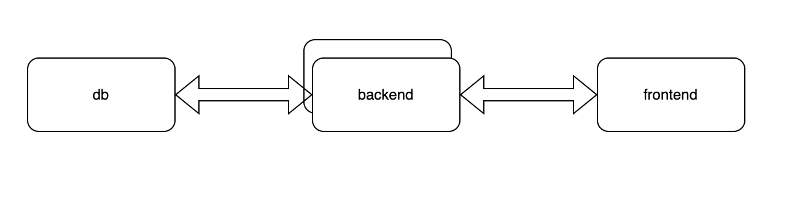

# Итоговый проект по программе DevOps Young&&Yandex

## Вводная

Привет!  
1 декабря, в 23:59 по московскому времени мы запускаем наш новый сервис - API хранилища истории сессий нашего онлайн кинотеатра «Фильмопоиск». Дату запуска сдвинуть нельзя, наш PR уже активно продвигает этот запуск. От тебя потребуется развернуть продуктовую инсталляцию этого сервиса.

Наш подрядчик "Horns&Hooves Soft inc" пишет для нас этот новый сервис. Неделю назад подрядчик провёл демонстрационную презентацию. На ней он показал почти корректно работающее приложение, и презентовал HTTP эндпоинт, который отвечает на GET /ping кодом 200, если приложение работает корректно и кодом 500, если нет.

Мы попросили внести небольшие изменения: нужно, чтобы запрос GET /long_dummy в 75% случаев работал быстрее секунды, при этом нас устроит закешированный ответ не старше минуты. На презентации он работал дольше. Кроме того, подрядчик сообщил, что потребуется внести некоторые технологические изменения для повышения удобства эксплуатации, а так же починить несколько некритичных багов для повышения стабильности в работе.

Вчера должна была состояться приёмка, но подрядчик на связь не вышел и перестал отвечать на письма, сообщения и звонки. 

Нам удалось выяснить, что у подрядчика возникли серьёзные форс-мажорные обстоятельства. Скорее всего получится возобновить взаимодействие не раньше 2 декабря, то есть уже после согласованной даты запуска. 
Подрядчик не успел предоставить документацию к приложению, и не смог развернуть у нас своё приложение в срок, как ранее обещал.
Тот стенд, на котором проводилась демонстрация, уже успели разобрать. К счастью, у нашего менеджера остался email с бинарником приложения, который использовали на демо.

https://storage.yandexcloud.net/final-homework/bingo – вот ссылка на этот бинарник.


## Задача

Твоя задача развернуть отказоустойчивую инсталляцию приложения из имеющегося бинарника до даты запуска продукта. Планируется стабильная нагрузка в 60 RPS, пиковая в 120 RPS.

В эту пятницу, 24 ноября, выходит из отпуска наш тестировщик Петя, который работал с подрядчиком и умеет тестировать это приложение. Он сможет проверить твою и инсталляцию и подсказать, что с ней не так, чтобы тебе было удобнее готовиться к финальному запуску.

Петя интроверт, не любит живое общение, поэтому он обещал сделать автоматику и помогать тебе с помощью специального сервиса - 
https://devops.yactf.ru

Посредством этого сервиса он и будет принимать решение о том, насколько тебе удалось справиться с требованиями технического задания.

## Требования (в порядке убывания важности):

- [x] Отказоустойчивость: сервис должен быть развернут на двух нодах, 
отказ любой из них должен быть незаметен пользователю. Допускается просадка по RPS до стабильного значения в момент отказа любой из нод.
При живости обеих нод, инсталяция обязана выдерживать пиковую нагрузку. 
Так же нужно обеспечить восстановление работоспособности любой отказавшей ноды быстрее, чем  за минуту.
- [x] Сервис должен переживать пиковую нагрузку в 120 RPS в течение 1 минуты, стабильную в 60 RPS.
- [x] Запросы POST /operation {"operation": <operation_id: integer>} должны возвращать незакешированный ответ. Сервер должен обрабатывать такие запросы и отдавать результат быстрее, чем за 400 миллисекунд в 90% случаев при 120 RPS, гарантируя не более 1% ошибок.
- [x] Запросы GET /db_dummy должны возвращать незакешированный ответ. Сервер должен обрабатывать такие запросы и отдавать результат быстрее, чем за 400 миллисекунд в 90% случаев при 120 RPS, гарантируя не более 1% ошибок.
- [x] Запросы GET /api/movie/{id} должны возвращать незакешированный ответ. Сервер должен обрабатывать такие запросы и отдавать результат быстрее, чем за 400 миллисекунд в 90%  случаев при 120 RPS, гарантируя не более 1% ошибок.
- [x] Запросы GET /api/customer/{id} должны возвращать незакешированный ответ. Сервер должен обрабатывать такие запросы и отдавать результат быстрее, чем за 400 миллисекунд в 90% случаев при 120 RPS, гарантируя не более 1% ошибок.
- [x] Запросы GET /api/session/{id} должны возвращать незакешированный ответ. Сервер должен обрабатывать такие запросы и отдавать результат быстрее, чем за 400 миллисекунд в 90%  случаев при 120 RPS, гарантируя не более 1% ошибок.
- [x] Запросы GET /api/movie должны возвращать незакешированный ответ. Сервер должен обрабатывать такие запросы и отдавать результат гарантируя не более 1% ошибок. Требований по времени ответа нет, планируем делать не более одного такого запроса одновременно.
- [x] Запросы GET /api/customer должны возвращать незакешированный ответ. Сервер должен обрабатывать такие запросы и отдавать результат гарантируя не более 1% ошибок. Требований по времени ответа нет, планируем делать не более одного такого запроса одновременно.
- [x] Запросы GET /api/session должны возвращать незакешированный ответ. Сервер должен обрабатывать такие запросы и отдавать результат гарантируя не более 5% ошибок. Требований по времени  ответа нет, планируем делать не более одного такого запроса одновременно.
- [x] Запросы POST /api/session должны возвращать незакешированный ответ. Сервер должен обрабатывать такие запросы и отдавать результат гарантируя не более 1% ошибок. Требований по  времени ответа и RPS нет.
- [x] Запросы DELETE /api/session/{id} должны возвращать незакешированный ответ. Сервер должен обрабатывать такие запросы и отдавать результат гарантируя не более 1% ошибок. Требований по  времени ответа и RPS нет.


## Задачи со звёздочкой

- [x] сделать так, чтобы сервис работал на отдельном домене по https протоколу, и по http без редиректа на https  (допускается самоподписанный сертификат).

- [x] сделать http3.

- [x] сделать так, чтобы запросы GET /long_dummy возвращали ответ не старше 1 минуты и отвечали быстрее, чем за 1 секунду в 75% случаев.

- [x] желательно обеспечить наблюдаемость приложения: графики RPS и ошибок по каждому эндпоинту.

- [x] автоматизировать развёртывание при помощи devops инструментов, с которыми вы успели познакомиться ранее.


## Немножко комментариев и рекомендаций:

- Для нас важно получить работающую инсталляцию, и менее важно как эта работоспособность была обеспечена.
Мы засчитываем только рабочие решения. В качестве решения помимо эндпоинта мы хотим увидеть, как эта инсталляция была развернута.
В минимальном варианте это должно быть сочинение на тему "как я это развернул руками". В идеале же, это должен быть репозиторий,  который при помощи различных devops инструментов способен развернуть всю инсталляцию по одной команде. Мы не ожидаем от всех участников идеального варианта, но автоматизированные решения при прочих равных, мы оценим выше неавтоматизированных. При этом работающее неавтоматизированное решение будет засчитано, а неработающее автоматизированное - нет;
- Бинарник умеет в развернутой базе данных создавать необходимые для работы таблицы и наполнять их тестовыми данными. Нужно его только об этом правильно попросить, уверен вы сможете разобраться как.
- Наличие в базе этих тестовых данных - одно из  необходимых условий успешного выполнения задания. Вы можете в рамках тестов создавать некоторые сущности в базе и их же удалять. Однако не стоит удалять ничего из изначально там заведённого - это может не понравиться автоматике, которая будет считать Ваш рейтинг;
- Важно убедиться в том, что на сервере настроено корректно точное время. Таймзона не имеет значения. В противном случае  некоторые наши проверки решат, что вы считерили, добавив кеширование там, где его быть не должно;
- В конфигурации есть параметр student_email - тут должен быть ваш email, который вы использовали при регистрации на тренировки - это важно для проверки задания;
- Хэлсчек в приложении есть, живёт на GET /ping и свою функцию выполняет;
- Можешь на своё усмотрение упаковать бинарник в docker image, либо этого не делать;
- Для тех, кто разворачивается в Яндекс.Облаке - разворачивайтесь в одной АЗ;
- Для самостоятельной проверки RPS и времени ответа своей инсталяции можете пользовать wrk / ab;
- Для SSL, http3 и кеширования мы рекомендуем использовать reverse proxy, которые это поддерживают, например nginx;
- Некоторый софт не умеет отдавать метрики в формате prometheus, для такого софта сбоку разворачивают что-то, что умеет собрать и отдать за него этиметрики. Гуглить по запросу "<название софта> export metrics".

## Решение

- [x] Запустить приложение **bingo**, изучить его поведение.  
**Инструменты**: strace,lsof, /proc/self. 
```
config - /opt/bingo/config.yaml
bin - /opt/bingo/bingo
log - /opt/bongo/logs/12690b3e5e/main.log
port - 15220
```
- [x] Загрузка бд и запуск bingo.   
**инструменты**: docker, bingo, postgresql   
**результат**: после загрузки тестовых данных, удалось запустить `bingo run_server`. и получить `pong`

- [x] Создать docker image.
**Требования**:  
    - запуск не под root
    - вывод логов в stdout*, этот пункт появился посже когда начал проводить тесты.
    - доп пакеты strace, curl  
Сложности были с запуском не от рута, помог гуглинг. В первых варинатах небыло ссылки на `/fd/1`.
Быстрый рост лог файла простимулировал поиск решения.
```
FROM alpine


RUN mkdir -p /opt/bingo && \
             mkdir -p /opt/bongo/logs/12690b3e5e && \
             ln -s /proc/1/fd/1 /opt/bongo/logs/12690b3e5e/main.log && \
             addgroup --gid 1000 nonroot && \
             adduser --u 1000 -G nonroot -g "" -D  nonroot && \
             apk --no-cache  add strace curl && \
             rm -vrf /var/cache/apk/*

COPY --chown=nonroot:nonroot bingo /opt/bingo/ 
RUN chown -R nonroot:nonroot /opt && \
    chmod -R 755 /opt/bingo/bingo

WORKDIR /opt/bingo
EXPOSE 15220/TCP
USER nonroot
CMD ["./bingo", "run_server" ]
```

- [x] docker-compose.  
**Требования**:
    - Установить лимиты
    - Проверять здоровья `/ping`
```
version: '3'
services:
  bingo:
    image: bingo-alpine:1.0
    restart: always
    ports:
      - 15220:15220
    volumes:
      - /tmp/config.yaml:/opt/bingo/config.yaml
    deploy:
      resources:
        limits:
          memory: 1G
          cpus: "1"
    healthcheck:
      start_period: 60s
      timeout: 1s
      interval: 2s
      retries: 2
      test: "curl -f http://localhost:15220/ping || exit 1"
```

- [x] Выбор инсталяции.  
Первый варинат был с группой виртальных машин, и сетевым балансировщиком но от него отказался. Не мог нормально сделать отладку. В итоге пришел к варианту что вся инсталяция строится на инстансах Ubuntu 20.04.

### Инфраструктура 




Развертывание решил делать с помощью terraform и ansible. Для каждой роли был написан playbook, со всеми шагами инсталации и настройки. Примерно в такой последовательности.

1. main.tf
2. db - pb_install_postgres.yml
3. backend - pb_install_app.yml
4. frontend - pb_install_web.yml

Около 2 дня ушло на написние этих плеев, в результате получилось полуручное разворачивание стенда.
последовательным применением команд, занимало около 20 минут.
```
terraform apply
ansible-playbook pb_install_*
```

После подготовки стенда начал проводить тесты, использовал `bash, curl, wrk, python`. Это помогло выявить проблемы со скоростью ответа. Далеше был поиск узкого мест(а). Узким местом казалась БД. Основная проблема была в отсутствии индексов и очень большом количесте подключений bingo -> db. 

**Инструменты:** pg_stat_statements, top, ss, netstat, psql(explane).

**Решение:** установка брокера ссесий - pgbouncer, создание индексов для таблиц session, customers, movies по колонке id, так же напрашивалась связь по внешнему ключу для sessions (создать не получилось, Петя результат не принимал. Пробовал добавить записи заглушки для id -1, 0, или удалить "битые" сессии.)


- [x] Настройка nginx

С настройкой nginx проблем не вознико.

- [x] Добиться идемпотентности для ansible.

Переписывал playbook, выносил чать задач в handlers.

- [x] Мониторинг  
были дописаны playbook, и изменена часть конфигов для сбора метрик.

  - nginx - prometheus-exporter
  - docker - сам умеет отдавать метрики
  - postgresql - postgres-exporter


- [x] Автоматизировать развертывание  
Полное развертывание происходит по команде terraform apply

terraform:

  - разворачивания инфраструктуру
  - генерирует файл inventory и фалы для ssh подключений
  - ждет когда поднимится jump-host, в этой роли выступает frontend.
  - запускает ansible-playbook  

**db**
```
null_resource.ansible_db (local-exec): Playbook run took 0 days, 0 hours, 11 minutes, 27 seconds
null_resource.ansible_db (local-exec): Sunday 03 December 2023  13:56:50 +0300 (0:00:00.825)       0:11:27.387 *******
null_resource.ansible_db (local-exec): ===============================================================================
null_resource.ansible_db (local-exec): Prepare bingo db ------------------------------------------------------ 538.77s
null_resource.ansible_db (local-exec): Install packeges ------------------------------------------------------- 51.65s
null_resource.ansible_db (local-exec): Add repo PostgreSQL ---------------------------------------------------- 31.54s
null_resource.ansible_db (local-exec): Create index ----------------------------------------------------------- 24.12s
null_resource.ansible_db (local-exec): Copy bingo -------------------------------------------------------------- 7.55s
null_resource.ansible_db (local-exec): Copy config ------------------------------------------------------------- 6.70s
null_resource.ansible_db (local-exec): Gathering Facts --------------------------------------------------------- 6.65s
null_resource.ansible_db (local-exec): Copy postgres-exporter -------------------------------------------------- 5.09s
null_resource.ansible_db (local-exec): Restart Service --------------------------------------------------------- 4.53s
null_resource.ansible_db (local-exec): Add key for PostgreSQL -------------------------------------------------- 2.24s
null_resource.ansible_db (local-exec): Copy exporter service --------------------------------------------------- 1.61s
null_resource.ansible_db (local-exec): Template iptables ------------------------------------------------------- 1.46s
null_resource.ansible_db (local-exec): Create a directory for bingo -------------------------------------------- 0.83s
null_resource.ansible_db (local-exec): Restart iptables -------------------------------------------------------- 0.83s
null_resource.ansible_db (local-exec): Restart exporter -------------------------------------------------------- 0.67s
null_resource.ansible_db (local-exec): Add the user postgres-exporter ------------------------------------------ 0.63s
null_resource.ansible_db (local-exec): Add user Bingo ---------------------------------------------------------- 0.61s
null_resource.ansible_db (local-exec): Create a new database bingo --------------------------------------------- 0.60s
null_resource.ansible_db (local-exec): Grant access remote connect --------------------------------------------- 0.55s
null_resource.ansible_db (local-exec): Create a directory for postgres-exporter -------------------------------- 0.38s
null_resource.ansible_db: Creation complete after 11m28s [id=6207618436162965410]
```

**backend**
```
null_resource.ansible_app (local-exec): Playbook run took 0 days, 0 hours, 2 minutes, 14 seconds
null_resource.ansible_app (local-exec): Sunday 03 December 2023  13:59:04 +0300 (0:00:00.692)       0:02:14.168 *******
null_resource.ansible_app (local-exec): ===============================================================================
null_resource.ansible_app (local-exec): Install docker depends ------------------------------------------------- 51.11s
null_resource.ansible_app (local-exec): Install Docker package ------------------------------------------------- 26.75s
null_resource.ansible_app (local-exec): Create autoheal container ---------------------------------------------- 14.80s
null_resource.ansible_app (local-exec): Copy docker image ------------------------------------------------------ 10.81s
null_resource.ansible_app (local-exec): Add Docker Repository --------------------------------------------------- 7.21s
null_resource.ansible_app (local-exec): Install docker python package ------------------------------------------- 6.12s
null_resource.ansible_app (local-exec): Gathering Facts --------------------------------------------------------- 4.42s
null_resource.ansible_app (local-exec): Start bingo project ----------------------------------------------------- 2.80s
null_resource.ansible_app (local-exec): Load image bingo -------------------------------------------------------- 2.67s
null_resource.ansible_app (local-exec): Restart docker ---------------------------------------------------------- 2.17s
null_resource.ansible_app (local-exec): Template iptables ------------------------------------------------------- 1.78s
null_resource.ansible_app (local-exec): Copy docker config ------------------------------------------------------ 1.67s
null_resource.ansible_app (local-exec): Add Docker GPG apt Key -------------------------------------------------- 1.15s
null_resource.ansible_app (local-exec): Restart iptables -------------------------------------------------------- 0.69s
null_resource.ansible_app: Creation complete after 2m15s [id=3654136403749948693]

```

**frontend**
```
null_resource.ansible_web (local-exec): Playbook run took 0 days, 0 hours, 0 minutes, 47 seconds
null_resource.ansible_web (local-exec): Sunday 03 December 2023  13:59:52 +0300 (0:00:00.660)       0:00:47.159 *******
null_resource.ansible_web (local-exec): ===============================================================================
null_resource.ansible_web (local-exec): Install depends -------------------------------------------------------- 17.73s
null_resource.ansible_web (local-exec): Install nginx ----------------------------------------------------------- 6.51s
null_resource.ansible_web (local-exec): Add nginx repository ---------------------------------------------------- 6.38s
null_resource.ansible_web (local-exec): Copy config nginx ------------------------------------------------------- 5.32s
null_resource.ansible_web (local-exec): Gathering Facts --------------------------------------------------------- 2.50s
null_resource.ansible_web (local-exec): Copy exporter bin ------------------------------------------------------- 1.99s
null_resource.ansible_web (local-exec): Copy exporter service --------------------------------------------------- 1.15s
null_resource.ansible_web (local-exec): Template iptables ------------------------------------------------------- 1.14s
null_resource.ansible_web (local-exec): Add nginx GPG apt Key --------------------------------------------------- 1.12s
null_resource.ansible_web (local-exec): Restart nginx ----------------------------------------------------------- 0.77s
null_resource.ansible_web (local-exec): Restart iptables -------------------------------------------------------- 0.66s
null_resource.ansible_web (local-exec): Add the user nginx-exporter --------------------------------------------- 0.64s
null_resource.ansible_web (local-exec): Restart exporter -------------------------------------------------------- 0.62s
null_resource.ansible_web (local-exec): Create a directory for cache -------------------------------------------- 0.61s
null_resource.ansible_web: Creation complete after 48s [id=1269605100036359637]

```

### Дерево проекта

```
bingo
├── README.md
├── ansible
│   ├── ansible.cfg
│   ├── files
│   │   ├── bingo
│   │   │   ├── Dockerfile
│   │   │   ├── bingo
│   │   │   ├── bingo-alpine.tar
│   │   │   ├── config.yaml
│   │   │   └── docker-compose.yaml
│   │   ├── docker
│   │   │   └── daemon.json
│   │   ├── nginx
│   │   │   ├── dhparam.pem
│   │   │   ├── nginx-prometheus-exporter
│   │   │   ├── nginx-selfsigned.crt
│   │   │   ├── nginx-selfsigned.key
│   │   │   ├── nginx.conf
│   │   │   └── nginx_exporter.service
│   │   └── postgresql
│   │       ├── pgbouncer.ini
│   │       ├── postgres_exporter
│   │       ├── postgres_exporter.env
│   │       ├── postgres_exporter.service
│   │       ├── postgresql_bingo.conf
│   │       └── userlist.txt
│   ├── group_vars
│   │   ├── backend.yml
│   │   ├── db.yaml
│   │   └── frontend.yml
│   ├── pb_install_app.yml
│   ├── pb_install_postgres.yml
│   ├── pb_install_web.yml
│   ├── requirements.txt
│   ├── ssh
│   │   ├── ansible_ssh_key
│   │   └── known_hosts
│   ├── templates
│   │   └── iptables.j2
│   ├── terraform.tfstate
│   └── tests
│       ├── curl
│       ├── curl_time.txt
│       ├── pg_explane.txt
│       ├── request.txt
│       ├── session.txt
│       ├── sessions.sh
│       └── test.sh
├── img
│   └── schema.png
├── setup.md
├── tasks.txt
└── tf
    ├── ansible_inventory.tftpl
    ├── ansible_ssh_key
    ├── ansible_ssh_key.pub
    ├── config.json
    ├── env_tf.sh
    ├── files
    ├── main.tf
    ├── outputs.tf
    ├── providers.tf
    ├── ssh_config.tftpl
    ├── terraform.tfstate
    ├── terraform.tfstate.backup
    ├── terraform.tfvars
    ├── tf-mgr_key.json
    ├── user.yaml
    └── variables.tf

```

Что не успел сделать:

- автоматизировать сборку образов
- развертывание из gitlab
- Шаблонизировать конфиги, вынести чать настроек в переменные,сделать роли
- сделать модуль для terraform.  
работы еще много...


## PS
Огромное спасибо все команде, которые делали этот проект, за позновательные лекции, и крутые задачи. Было очень интересно и позновательно.


